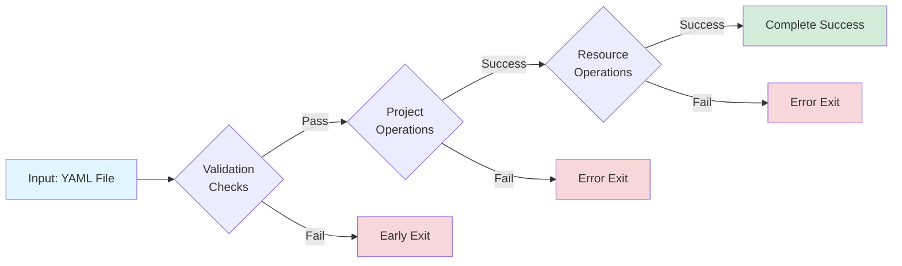
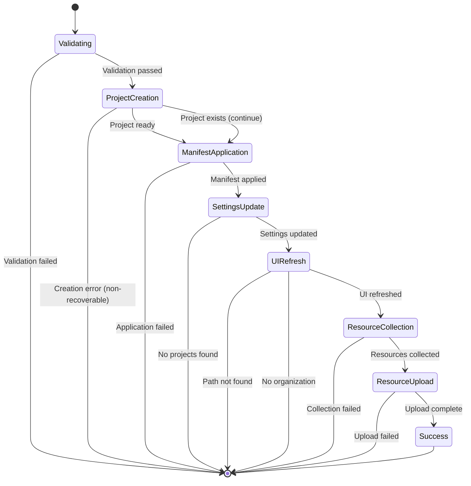

# Apply Manifest Command - Execution Flows

## Overview

The `applyManifest` command ([applyManifest.vscommands.ts](../../src/vscommands/applyManifest.vscommands.ts)) applies a YAML manifest file to create/update an AutoKitteh project and upload its resources.

## Command Flow Diagram

```mermaid
flowchart TD
    Start([User executes applyManifest]) --> CheckEditor{Active editor<br/>exists?}

    CheckEditor -->|No| Exit1([Exit silently])
    CheckEditor -->|Yes| CheckYAML{File is<br/>.yaml/.yml?}

    CheckYAML -->|No| ShowYAMLError[Show error:<br/>'Only YAML files']
    ShowYAMLError --> Exit2([Exit])

    CheckYAML -->|Yes| ParseYAML[Parse YAML to<br/>extract project name]
    ParseYAML --> CreateProject[Create project via<br/>ProjectsService.create]

    CreateProject --> CreateSuccess{Creation<br/>successful?}

    CreateSuccess -->|ConnectError| HandleError{handleConnectError<br/>should return?}
    HandleError -->|Yes| Exit3([Exit])
    HandleError -->|No<br/>AlreadyExists| ApplyManifest

    CreateSuccess -->|Other Error| ShowCreateError[Show error message]
    ShowCreateError --> Exit4([Exit])

    CreateSuccess -->|Success| ApplyManifest[Apply manifest via<br/>ManifestService.applyManifest]

    ApplyManifest --> ApplySuccess{Manifest<br/>applied?}

    ApplySuccess -->|Error| CatchBlock[Caught in catch block]
    CatchBlock --> ShowApplyError[Show error message]
    ShowApplyError --> Exit5([Exit])

    ApplySuccess -->|Success| CheckProjectIds{projectIds<br/>length > 0?}

    CheckProjectIds -->|No| Exit6([Exit silently])

    CheckProjectIds -->|Yes| UpdateSettings[Update VSCode settings<br/>with project path mapping]
    UpdateSettings --> ReloadProjects[Reload projects in sidebar]
    ReloadProjects --> LogManifest[Log manifest application logs]
    LogManifest --> ShowSuccess1[Show success message]
    ShowSuccess1 --> ScheduleRefresh[Schedule sidebar refresh<br/>2.5s delay]

    ScheduleRefresh --> CheckPaths{VSCode project<br/>paths empty?}

    CheckPaths -->|Yes| ShowPathError[Show error:<br/>'No projects saved']
    ShowPathError --> Exit7([Exit])

    CheckPaths -->|No| FindProjectPath{Find project path<br/>in settings?}

    FindProjectPath -->|Not found| LogPathError[Log error:<br/>'Not in project']
    LogPathError --> Exit8([Exit])

    FindProjectPath -->|Found| CheckOrg{Organization<br/>selected?}

    CheckOrg -->|No & Auth token exists| PromptOrg[Execute changeOrganization<br/>command]
    PromptOrg --> Exit9([Exit - retry after<br/>org selection])

    CheckOrg -->|Yes| CollectResources[Collect local resources<br/>via getLocalResources]

    CollectResources --> ResourcesCollected{Resources<br/>collected?}

    ResourcesCollected -->|No| LogResourceError[Log error:<br/>'Collect resources failed']
    LogResourceError --> Exit10([Exit])

    ResourcesCollected -->|Yes| FilterResources[Filter out<br/>autokitteh.yaml]
    FilterResources --> UploadResources[Upload resources via<br/>ProjectsService.setResources]

    UploadResources --> UploadSuccess{Upload<br/>successful?}

    UploadSuccess -->|No| ShowUploadError[Show error:<br/>'Set resources failed']
    ShowUploadError --> Exit11([Exit])

    UploadSuccess -->|Yes| LogResourceSuccess[Log success:<br/>'Resources set success']
    LogResourceSuccess --> ShowSuccess2[Show success message:<br/>'Resources updated']
    ShowSuccess2 --> CompleteSuccess([✅ Complete Success])

    style Start fill:#e1f5ff
    style CompleteSuccess fill:#d4edda
    style Exit1 fill:#f8d7da
    style Exit2 fill:#f8d7da
    style Exit3 fill:#f8d7da
    style Exit4 fill:#f8d7da
    style Exit5 fill:#f8d7da
    style Exit6 fill:#f8d7da
    style Exit7 fill:#f8d7da
    style Exit8 fill:#f8d7da
    style Exit9 fill:#fff3cd
    style Exit10 fill:#f8d7da
    style Exit11 fill:#f8d7da
```



## Decision Points



## Execution Paths

### Path 1: Early Exit - No Active Editor
**Lines**: 12-14
**Trigger**: No file open in editor
**Outcome**: Silent exit

```typescript
if (!window.activeTextEditor) {
    return;
}
```

---

### Path 2: Invalid File Type
**Lines**: 16-21
**Trigger**: Non-YAML file open
**Steps**:
1. Extract file extension
2. Check if NOT `.yaml` or `.yml`
3. Show error: "manifest.onlyYamlFiles"

**Outcome**: Error displayed, exit

---

### Path 3: Project Creation Fails (Non-ConnectError)
**Lines**: 32-48
**Trigger**: Network timeout or unexpected error during project creation
**Steps**:
1. Parse YAML for project name
2. Attempt `ProjectsService.create()`
3. Non-ConnectError thrown
4. Show error message

**Outcome**: Project creation fails, exit

---

### Path 4: Project Creation Fails (ConnectError - Should Return)
**Lines**: 38-42
**Trigger**: ConnectError that requires stopping (auth error, permission denied)
**Steps**:
1. Attempt project creation
2. ConnectError thrown
3. `handleConnectError()` returns `true`
4. Exit

**Outcome**: Execution stops based on error type

---

### Path 5: Project Already Exists (Continues)
**Lines**: 38-43
**Trigger**: Project with same name exists
**Steps**:
1. Attempt project creation
2. ConnectError with `Code.AlreadyExists`
3. `handleConnectError()` returns `false`
4. Continue to manifest application

**Outcome**: Proceeds with existing project

---

### Path 6: Manifest Application Fails
**Lines**: 51-59, 151-154
**Trigger**: Backend error during manifest application
**Steps**:
1. Project created/exists
2. `ManifestService.applyManifest()` fails
3. Error caught in catch block
4. Show error message

**Outcome**: Manifest not applied, exit

---

### Path 7: No Projects Created
**Lines**: 89-91
**Trigger**: Manifest returns empty `projectIds` array
**Steps**:
1. Manifest applied successfully
2. `projectIds.length === 0`
3. Silent return

**Outcome**: No actionable projects, exit

---

### Path 8: No Project Path in Settings
**Lines**: 102-106
**Trigger**: Manifest directory not in saved project paths
**Steps**:
1. Manifest applied, project ID exists
2. Loop through `vscodeProjectsPaths`
3. No match found
4. Log error: "projects.notInProject"

**Outcome**: Cannot upload resources, exit

---

### Path 9: No Organization Selected
**Lines**: 107-116
**Trigger**: User authenticated but no organization selected
**Steps**:
1. Project path found
2. Organization ID undefined
3. Auth token exists
4. Execute `changeOrganization` command
5. Log error: "projects.noOrganizationSelected"

**Outcome**: User prompted for organization selection, exit

---

### Path 10: Getting Local Resources Fails
**Lines**: 120-128
**Trigger**: Filesystem error or no resources found
**Steps**:
1. Has project path and organization
2. `getLocalResources()` fails or returns null
3. Log error: "projects.collectResourcesFailed"

**Outcome**: Cannot upload resources, exit

---

### Path 11: Setting Resources Fails
**Lines**: 133-145
**Trigger**: Backend error during resource upload
**Steps**:
1. Local resources collected
2. Filter out `autokitteh.yaml`
3. `ProjectsService.setResources()` fails
4. Show error: "projects.setResourcesFailed"

**Outcome**: Resources not uploaded, exit

---

### Path 12: Complete Success ✅
**Lines**: 51-150 (full flow)
**Trigger**: Everything works correctly

**Steps**:
1. ✅ YAML file open in editor
2. ✅ File extension is `.yaml` or `.yml`
3. ✅ Project created OR already exists
4. ✅ Manifest applied successfully
5. ✅ Project IDs returned
6. ✅ Update VSCode settings with project path mapping
7. ✅ Reload projects in sidebar
8. ✅ Log manifest application
9. ✅ Show success message: "manifest.appliedSuccessfully"
10. ✅ Schedule sidebar refresh (2.5s delay)
11. ✅ Find project ID from path mapping
12. ✅ Organization is selected
13. ✅ Collect local resources
14. ✅ Filter out `autokitteh.yaml`
15. ✅ Upload resources to backend
16. ✅ Log success: "projects.resourcesSetSuccess"
17. ✅ Show success: "projects.resourcesUpdatedSuccess"

**Outcome**: Project created/updated, manifest applied, resources uploaded, UI updated

---

### Path 13: No Projects in VSCode Settings
**Lines**: 83-87
**Trigger**: VSCode settings have no saved project paths
**Steps**:
1. Manifest applied
2. `vscodeProjectsPaths` is empty
3. Log error: "projects.noProjectSavedInVSCodeSettings"
4. Show error message

**Outcome**: Cannot proceed, exit

---

### Path 14: Unexpected Exception
**Lines**: 151-154
**Trigger**: Any unexpected error in try block
**Steps**:
1. Operation throws error
2. Catch block captures error
3. Show error message with details

**Outcome**: Generic error handling

---

## State Transitions



## Key Decision Points Summary

| Line | Decision | Possible Outcomes |
|------|----------|-------------------|
| 12 | Active editor? | Exit / Continue |
| 18 | YAML file? | Error / Continue |
| 37 | Create error? | Exit / Handle error / Continue |
| 38-39 | ConnectError type? | Exit / Continue (AlreadyExists) |
| 57 | Manifest error? | Throw error / Continue |
| 70 | Has project IDs? | Exit / Continue |
| 83 | Has project paths? | Error / Continue |
| 89 | Project IDs exist? | Exit / Continue |
| 102 | Project path found? | Error / Continue |
| 109 | Organization selected? | Prompt user / Continue |
| 122 | Resources collected? | Error / Continue |
| 135 | Resources uploaded? | Error / Success |

## Data Flow


## Error Handling Strategy

The command uses a layered error handling approach:

1. **Early Validation** (lines 12-21): Validates prerequisites before any operations
2. **Operation-Level Errors** (lines 37-42): Handles specific operation failures with context
3. **ConnectError Handling** (lines 38-42): Special handling for gRPC connection errors
4. **Catch-All Handler** (lines 151-154): Catches unexpected exceptions

## Success Criteria

For the command to complete successfully, ALL of the following must be true:

- ✅ Active text editor exists
- ✅ Open file is `.yaml` or `.yml`
- ✅ Project can be created OR already exists
- ✅ Manifest can be applied to backend
- ✅ At least one project ID is returned
- ✅ Project path can be stored in VSCode settings
- ✅ Organization is selected (if authenticated)
- ✅ Local resources can be collected from filesystem
- ✅ Resources can be uploaded to backend

**Total Possible Paths**: 14
**Error Exit Points**: 11
**Success Paths**: 1
**Warning/Prompt Paths**: 1 (organization selection)

## Related Code References

- Service Layer: [ManifestService](../../src/services/manifest.service.ts)
- Service Layer: [ProjectsService](../../src/services/projects.service.ts)
- Utility: [getLocalResources](../../src/utilities/getLocalResources.ts)
- Error Handling: [handleConnectError](../../src/utilities/connectError.ts)
