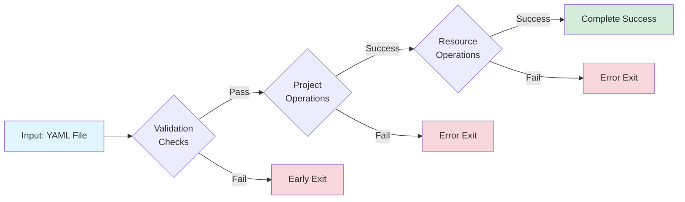
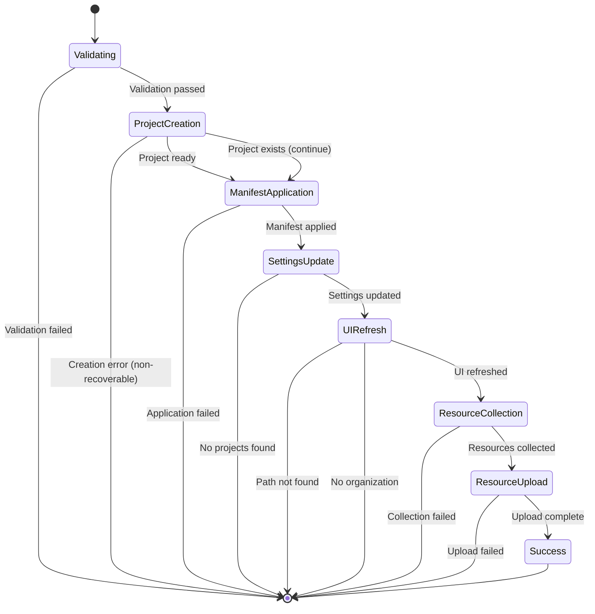

# Apply Manifest Command - Execution Flows

## Overview

The `applyManifest` command ([applyManifest.vscommands.ts](../../src/vscommands/applyManifest.vscommands.ts)) applies a YAML manifest file to create/update an AutoKitteh project and upload its resources.

## Command Flow Diagram

```mermaid
flowchart TD
    Start([User executes applyManifest]) --> CheckEditor{Active editor<br/>exists?}

    CheckEditor -->|No| Exit1([Exit silently])
    CheckEditor -->|Yes| CheckYAML{File is<br/>.yaml/.yml?}

    CheckYAML -->|No| ShowYAMLError[Show error:<br/>'Only YAML files']
    ShowYAMLError --> Exit2([Exit])

    CheckYAML -->|Yes| ParseYAML[Parse YAML to<br/>extract project name]
    ParseYAML --> CheckProjectExists{Project with<br/>name exists?}

    CheckProjectExists -->|Yes| ShowExistsError[Show error:<br/>'Project already exists']
    ShowExistsError --> Exit3([Exit])

    CheckProjectExists -->|No| CreateProject[Create project via<br/>ProjectsService.create]

    CreateProject --> CreateSuccess{Creation<br/>successful?}

    CreateSuccess -->|ConnectError| HandleError{handleConnectError<br/>should return?}
    HandleError -->|Yes| Exit4([Exit])
    HandleError -->|No| ApplyManifest

    CreateSuccess -->|Other Error| ShowCreateError[Show error message]
    ShowCreateError --> Exit5([Exit])

    CreateSuccess -->|Success| ApplyManifest[Apply manifest via<br/>ManifestService.applyManifest]

    ApplyManifest --> ApplySuccess{Manifest<br/>applied?}

    ApplySuccess -->|Error| CatchBlock[Caught in catch block]
    CatchBlock --> ShowApplyError[Show error message]
    ShowApplyError --> Exit6([Exit])

    ApplySuccess -->|Success| CheckProjectIds{projectIds<br/>length > 0?}

    CheckProjectIds -->|No| Exit7([Exit silently])

    CheckProjectIds -->|Yes| UpdateSettings[Update VSCode settings<br/>with project path mapping]
    UpdateSettings --> ReloadProjects[Reload projects in sidebar]
    ReloadProjects --> LogManifest[Log manifest application logs]
    LogManifest --> ShowSuccess1[Show success message]
    ShowSuccess1 --> ScheduleRefresh[Schedule sidebar refresh<br/>2.5s delay]

    ScheduleRefresh --> CheckPaths{VSCode project<br/>paths empty?}

    CheckPaths -->|Yes| ShowPathError[Show error:<br/>'No projects saved']
    ShowPathError --> Exit8([Exit])

    CheckPaths -->|No| FindProjectPath{Find project path<br/>in settings?}

    FindProjectPath -->|Not found| LogPathError[Log error:<br/>'Not in project']
    LogPathError --> Exit9([Exit])

    FindProjectPath -->|Found| CollectResources[Collect local resources<br/>via getLocalResources]

    CollectResources --> ResourcesCollected{Resources<br/>collected?}

    ResourcesCollected -->|No| LogResourceError[Log error:<br/>'Collect resources failed']
    LogResourceError --> Exit10([Exit])

    ResourcesCollected -->|Yes| FilterResources[Filter out<br/>autokitteh.yaml]
    FilterResources --> UploadResources[Upload resources via<br/>ProjectsService.setResources]

    UploadResources --> UploadSuccess{Upload<br/>successful?}

    UploadSuccess -->|No| ShowUploadError[Show error:<br/>'Set resources failed']
    ShowUploadError --> Exit11([Exit])

    UploadSuccess -->|Yes| LogResourceSuccess[Log success:<br/>'Resources set success']
    LogResourceSuccess --> ShowSuccess2[Show success message:<br/>'Resources updated']
    ShowSuccess2 --> CompleteSuccess([✅ Complete Success])

    style Start fill:#e1f5ff
    style CompleteSuccess fill:#d4edda
    style Exit1 fill:#f8d7da
    style Exit2 fill:#f8d7da
    style Exit3 fill:#f8d7da
    style Exit4 fill:#f8d7da
    style Exit5 fill:#f8d7da
    style Exit6 fill:#f8d7da
    style Exit7 fill:#f8d7da
    style Exit8 fill:#f8d7da
    style Exit9 fill:#f8d7da
    style Exit10 fill:#f8d7da
    style Exit11 fill:#f8d7da
```



## Decision Points



## Execution Paths

### Path 1: Early Exit - No Active Editor
**Lines**: 12-14
**Trigger**: No file open in editor
**Outcome**: Silent exit

```typescript
if (!window.activeTextEditor) {
    return;
}
```

---

### Path 2: Invalid File Type
**Lines**: 16-25
**Trigger**: Non-YAML file open
**Steps**:
1. Extract file extension
2. Check if NOT `.yaml` or `.yml`
3. Show error: "manifest.onlyYamlFiles"
4. Log error with request context

**Outcome**: Error displayed, exit

---

### Path 3: Project Already Exists
**Lines**: 36-51
**Trigger**: Project with same name already exists
**Steps**:
1. Parse YAML for project name
2. Call `ProjectsService.get()` to check if project exists
3. Project found with matching name
4. Show error: "manifest.projectAlreadyExists"
5. Log error with project name

**Outcome**: Cannot create duplicate project, exit

---

### Path 4: Project Creation Fails (Non-ConnectError)
**Lines**: 53-68
**Trigger**: Network timeout or unexpected error during project creation
**Steps**:
1. Project existence check passed
2. Attempt `ProjectsService.create()`
3. Non-ConnectError thrown
4. Show error message

**Outcome**: Project creation fails, exit

---

### Path 5: Project Creation Fails (ConnectError)
**Lines**: 58-63
**Trigger**: ConnectError that requires stopping (auth error, permission denied)
**Steps**:
1. Attempt project creation
2. ConnectError thrown
3. `handleConnectError()` returns `true`
4. Exit

**Outcome**: Execution stops based on error type

---

### Path 6: Manifest Application Fails
**Lines**: 70-79, 176-179
**Trigger**: Backend error during manifest application
**Steps**:
1. Project created/exists
2. `ManifestService.applyManifest()` fails
3. Error caught in catch block
4. Show error message

**Outcome**: Manifest not applied, exit

---

### Path 7: No Projects Created
**Lines**: 81-89
**Trigger**: Manifest returns empty `projectIds` array
**Steps**:
1. Manifest applied successfully
2. `projectIds.length === 0`
3. Log error and silent return

**Outcome**: No actionable projects, exit

---

### Path 8: No Projects in VSCode Settings
**Lines**: 112-116
**Trigger**: VSCode settings have no saved project paths
**Steps**:
1. Manifest applied
2. `vscodeProjectsPaths` is empty
3. Log error: "projects.noProjectSavedInVSCodeSettings"
4. Show error message

**Outcome**: Cannot proceed, exit

---

### Path 9: No Project Path in Settings
**Lines**: 118-131
**Trigger**: Manifest directory not in saved project paths
**Steps**:
1. Manifest applied, project ID exists
2. Loop through `vscodeProjectsPaths`
3. No match found for manifest directory
4. Log error: "projects.notInProject"

**Outcome**: Cannot upload resources, exit

---

### Path 10: Getting Local Resources Fails
**Lines**: 144-153
**Trigger**: Filesystem error or no resources found
**Steps**:
1. Has project path
2. `getLocalResources()` fails or returns null
3. Log error: "projects.collectResourcesFailed"

**Outcome**: Cannot upload resources, exit

---

### Path 11: Setting Resources Fails
**Lines**: 158-170
**Trigger**: Backend error during resource upload
**Steps**:
1. Local resources collected
2. Filter out `autokitteh.yaml`
3. `ProjectsService.setResources()` fails
4. Show error: "projects.setResourcesFailed"

**Outcome**: Resources not uploaded, exit

---

### Path 12: Complete Success ✅
**Lines**: 11-175 (full flow)
**Trigger**: Everything works correctly

**Steps**:
1. ✅ YAML file open in editor
2. ✅ File extension is `.yaml` or `.yml`
3. ✅ Parse YAML for project name
4. ✅ Project does NOT already exist
5. ✅ Project created successfully
6. ✅ Manifest applied successfully
7. ✅ Project IDs returned
8. ✅ Update VSCode settings with project path mapping
9. ✅ Reload projects in sidebar
10. ✅ Log manifest application
11. ✅ Show success message: "manifest.appliedSuccessfully"
12. ✅ Schedule sidebar refresh (2.5s delay)
13. ✅ VSCode project paths exist
14. ✅ Find project ID from path mapping
15. ✅ Collect local resources
16. ✅ Filter out `autokitteh.yaml`
17. ✅ Upload resources to backend
18. ✅ Log success: "projects.resourcesSetSuccess"
19. ✅ Show success: "projects.resourcesUpdatedSuccess"

**Outcome**: Project created, manifest applied, resources uploaded, UI updated

---

### Path 13: Unexpected Exception
**Lines**: 176-179
**Trigger**: Any unexpected error in try block
**Steps**:
1. Operation throws error
2. Catch block captures error
3. Show error message with details

**Outcome**: Generic error handling

---

## State Transitions



## Key Decision Points Summary

| Line | Decision | Possible Outcomes |
|------|----------|-------------------|
| 12 | Active editor? | Exit / Continue |
| 18 | YAML file? | Error / Continue |
| 36 | Project already exists? | Error / Continue |
| 58 | Create error? | Exit / Handle error / Continue |
| 59-60 | ConnectError type? | Exit / Continue |
| 76 | Manifest error? | Throw error / Continue |
| 81 | Has project IDs? | Exit / Continue |
| 112 | Has project paths? | Error / Continue |
| 120 | Project path found? | Error / Continue |
| 147 | Resources collected? | Error / Continue |
| 160 | Resources uploaded? | Error / Success |

## Data Flow


## Error Handling Strategy

The command uses a layered error handling approach:

1. **Early Validation** (lines 12-25): Validates prerequisites before any operations
2. **Existence Check** (lines 36-51): Prevents duplicate project creation
3. **Operation-Level Errors** (lines 58-68): Handles specific operation failures with context
4. **ConnectError Handling** (lines 59-63): Special handling for gRPC connection errors
5. **Catch-All Handler** (lines 176-179): Catches unexpected exceptions

## Success Criteria

For the command to complete successfully, ALL of the following must be true:

- ✅ Active text editor exists
- ✅ Open file is `.yaml` or `.yml`
- ✅ Project with same name does NOT already exist
- ✅ Project can be created successfully
- ✅ Manifest can be applied to backend
- ✅ At least one project ID is returned
- ✅ Project path can be stored in VSCode settings
- ✅ Project path mapping can be found
- ✅ Local resources can be collected from filesystem
- ✅ Resources can be uploaded to backend

**Total Possible Paths**: 13
**Error Exit Points**: 11
**Success Paths**: 1

## Related Code References

- Service Layer: [ManifestService](../../src/services/manifest.service.ts)
- Service Layer: [ProjectsService](../../src/services/projects.service.ts)
- Utility: [getLocalResources](../../src/utilities/getLocalResources.ts)
- Error Handling: [handleConnectError](../../src/utilities/connectError.ts)
